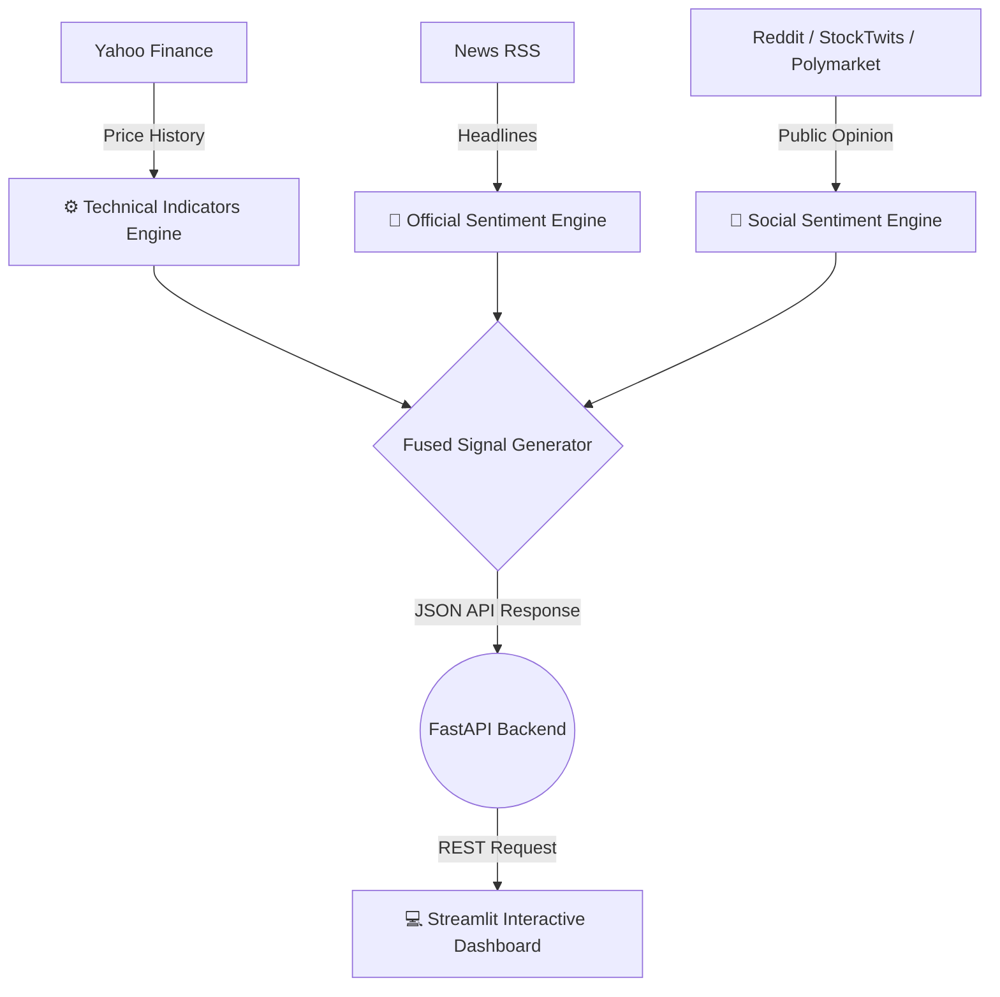

<h1 align="center">
  StockPulse 📈
</h1>

<p align="center">
  <i>A comprehensive quantitative dashboard fusing technical market data with multi-channel social sentiment (Polymarket, Reddit, StockTwits, Yahoo Finance) to generate actionable trading signals.</i>
</p>

<p align="center">
  
  
  
  
</p>

---

## 📖 Overview

Standard stock dashboards only show you what *has* happened (price history). **StockPulse** (internally known as Feelow) is designed to show you what is *currently* happening in the collective market psyche. 

By aggregating hard quantitative data alongside real-time human prediction markets and social media sentiment, StockPulse delivers a fused, AI-driven `BUY`, `SELL`, or `HOLD` signal.

---

## ✨ Key Features

- **📊 Technical Analysis Engine**: Automatically computes moving averages, RSI, MACD, and Bollinger Bands using Yahoo Finance (`yfinance`) and `pandas-ta`.
- **🌐 Multi-Channel Social Ingestion**: Scrapes and analyzes public opinion metrics from **Reddit**, **StockTwits**, and **Polymarket** prediction markets.
- **📰 Institutional News Sentiment**: Parses Yahoo Finance RSS feeds in real-time, utilizing NLP Transformers to grade official news headlines as bullish or bearish.
- **🧠 Fused Intelligence Signal**: Our backend engine weighs technical momentum against retail/institutional sentiment to output a consolidated trading recommendation.
- **🖥️ Interactive Dashboard**: A highly responsive, pure-Python dashboard built in Streamlit featuring dynamic `plotly` visualizations.

---

## 🛠️ Architecture & Tech Stack



- **Backend / API:** [FastAPI](https://fastapi.tiangolo.com/), `uvicorn`
- **Frontend / UI:** [Streamlit](https://streamlit.io/), `plotly`
- **Data Engineering:** `yfinance`, `pandas`, `pandas-ta`, `beautifulsoup4`
- **NLP / ML:** `transformers` (Hugging Face)

---

## 🚀 Quick Start Guide

### 1. Prerequisites
Ensure you have **Python 3.10+** installed on your system.

### 2. Clone the Repository
```bash
git clone https://github.com/rajhodedara/StockPulse.git
cd StockPulse
```

### 3. Install Dependencies
```bash
# It is recommended to use a virtual environment
python -m venv venv
source venv/bin/activate  # On Windows use `venv\Scripts\activate`

# Install all core and data dependencies
pip install -r requirements.txt
```

### 4. Run the Application Services

StockPulse runs on a decoupled architecture. You will need two terminal windows:

**Terminal 1: Start the FastAPI Backend**
```bash
# From the root directory
uvicorn backend.main:app --reload --port 8000
```
*The API will be available at `http://localhost:8000/docs`.*

**Terminal 2: Start the Streamlit Frontend**
```bash
# From the root directory
cd frontend
streamlit run app.py
```
*The Dashboard will automatically open in your browser at `http://localhost:8501`.*

---

## 📁 Repository Structure

```text
StockPulse/
├── backend/
│   ├── data/
│   │   ├── market_data.py       # YFinance historical ingestion
│   │   ├── news_ingestor.py     # RSS Headline parsing
│   │   ├── social_ingestor.py   # Reddit & StockTwits scraping
│   │   └── technical.py         # Pandas-TA calculations
│   ├── models/
│   │   ├── public_opinion_engine.py  # Retail sentiment scoring
│   │   └── sentiment_engine.py       # Institutional/News scoring
│   └── main.py                  # FastAPI route definitions
├── frontend/
│   └── app.py                   # Streamlit layout & Plotly graphs
├── Dockerfile                   # Containerization configs
├── requirements.txt             # Python dependencies
└── FEELLOW_TECHNICAL_BREAKDOWN.md # In-depth documentation
```

---

## 🛡️ Disclaimer
*StockPulse is a research and educational tool. The generated BUY/SELL/HOLD signals do not constitute financial advice. Always do your own due diligence before trading.*